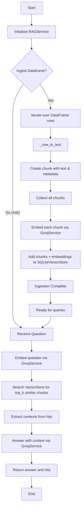

# Process Flow  
---
*Professional SQL-to-Vector RAG to connect SQL databases, ingesting query results as chunks into a vector store, and supporting chat over retrieved context.*
---
##  Diagram

---
### Execution Flow
1. **Initialization** – An `RAGService` instance is created with concrete `SQLiteVectorStore` and `GroqService` objects (usually in `app.py`).
2. **Ingestion** – `ingest_dataframe` transforms each DataFrame row into a textual chunk, enriches it with metadata, embeds it via the LLM, and stores both in the vector store.
3. **Querying** – `ask` embeds the incoming question, retrieves the most relevant chunks, builds a context list, and asks the LLM to generate an answer.
4. **Result** – The caller receives the answer string and the hit metadata for traceability.

